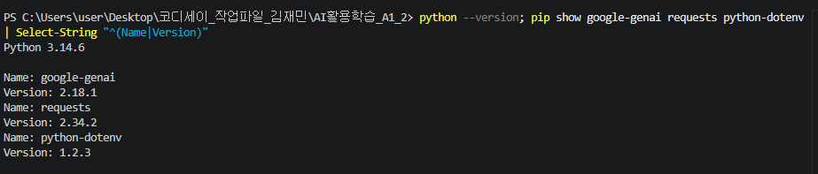
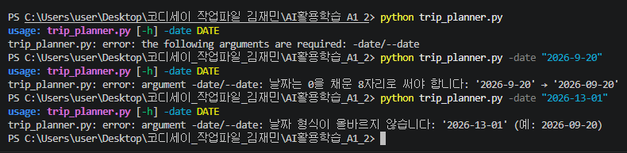
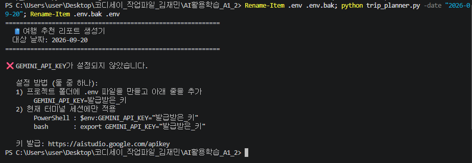
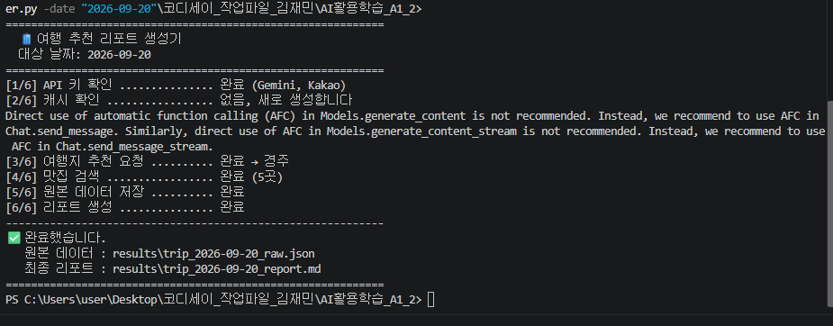
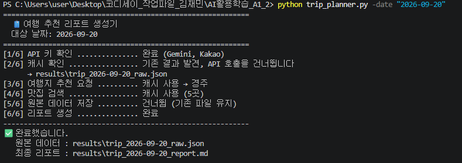
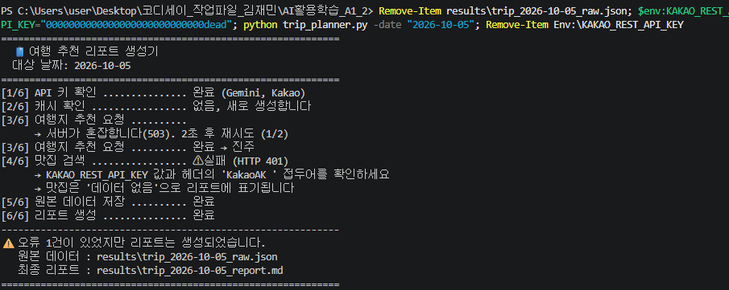
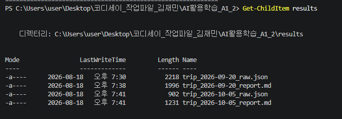
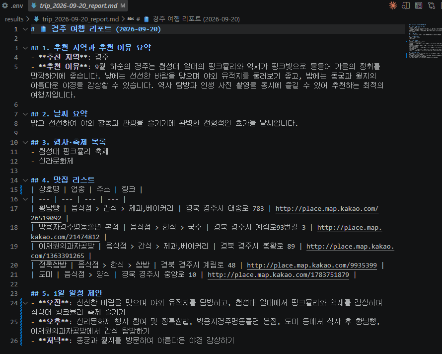
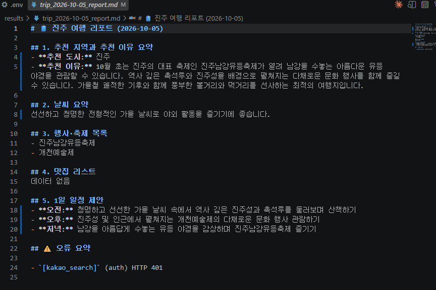

# 🧳 Trip Planner (여행 추천 리포트 생성기)

날짜 하나를 입력하면 **LLM으로 여행지를 추천받고 → 그 도시의 맛집을 지도 API로 검색해 →
최종 여행 리포트(Markdown)를 생성하는** Python CLI 프로그램입니다.

```
python trip_planner.py -date "2026-09-20"
```

한 번 실행하면 `results/` 폴더에 **원본 데이터 JSON**과 **여행 리포트 Markdown**이 만들어집니다.

| 단계 | 하는 일 | 사용 API |
|:---:|---------|----------|
| 1 | 날짜를 받아 여행지·날씨·행사를 **JSON으로** 추천받는다 | Google Gemini |
| 2 | 추천된 도시로 **맛집 5곳**을 검색한다 | Kakao Local |
| 3 | 1·2의 결과를 합쳐 **여행 리포트**를 작성한다 | Google Gemini |

**1단계의 출력이 2단계의 입력이 됩니다.** 그래서 1단계는 사람이 읽는 문장이 아니라
`recommended_city` 키를 코드로 꺼낼 수 있는 **JSON**이어야 합니다. 이것이 이 과제의 핵심입니다.

---

## 실행 방법

**요구 사항**: Python 3.10 이상 (개발·테스트 환경: Python 3.14.6)

### 1. 의존성 설치

```bash
pip install -r requirements.txt
```

| 패키지 | 용도 |
|--------|------|
| `google-genai` | Gemini API SDK |
| `requests` | Kakao Local REST API 호출 |
| `python-dotenv` | `.env` 파일에서 API 키 로드 |

### 2. API 키 설정

아래 [API 키 설정 방법](#api-키-설정-방법)을 먼저 진행하십시오. 키가 없으면 실행되지 않습니다.

### 3. 실행

```bash
python trip_planner.py -date "2026-09-20"
```

`-date`는 **필수**이며 `YYYY-MM-DD` 형식이어야 합니다. 형식이 틀리면 사용법을 출력하고 종료합니다.

```
$ python trip_planner.py -date "2026-9-20"
usage: trip_planner.py [-h] -date DATE
trip_planner.py: error: argument -date/--date: 날짜는 0을 채운 8자리로 써야 합니다: '2026-9-20' → '2026-09-20'
```

---

## API 키 설정 방법

이 프로그램은 키를 **코드에 담지 않습니다.** 환경변수 또는 `.env` 파일에서 읽습니다.

### 필요한 키

| 환경변수 | 발급처 | 없으면 |
|----------|--------|--------|
| `GEMINI_API_KEY` | [Google AI Studio](https://aistudio.google.com/apikey) | **즉시 종료** (추천도 리포트도 불가) |
| `KAKAO_REST_API_KEY` | [Kakao Developers](https://developers.kakao.com) → 내 애플리케이션 → 앱 키 | 맛집만 "데이터 없음"으로 두고 **계속 진행** |
| `PLACE_PROVIDER` | (선택) `kakao` 또는 `naver` | 기본값 `kakao` |
| `NAVER_CLIENT_ID`<br>`NAVER_CLIENT_SECRET` | [네이버 개발자센터](https://developers.naver.com) | `PLACE_PROVIDER=naver`일 때만 필요 |

장소 검색 제공자는 **코드를 고치지 않고 `PLACE_PROVIDER`로 교체**할 수 있습니다.
자세한 구조는 [지도/장소 제공자 교체](#지도장소-제공자-교체)를 보십시오.

> ⚠️ **카카오는 키가 4종류입니다.** 이 프로그램은 서버에서 HTTP로 직접 호출하므로
> **REST API 키**를 씁니다. 네이티브 앱 키·JavaScript 키는 맞지 않고,
> **Admin 키는 앱의 모든 권한을 가지므로 절대 사용하지 마십시오.**

### 방법 1 — `.env` 파일 (권장)

프로젝트 폴더의 `.env.example`을 복사해 `.env`를 만들고 값을 채웁니다.

```bash
cp .env.example .env
```

```
GEMINI_API_KEY=발급받은_키
KAKAO_REST_API_KEY=발급받은_키
```

따옴표 없이, `=` 앞뒤 공백 없이 씁니다. `.env`는 `.gitignore`에 등록되어 있어 커밋되지 않습니다.

### 방법 2 — 환경변수 (현재 터미널 세션에만 적용)

```powershell
$env:GEMINI_API_KEY="YOUR_KEY"
```

```bash
export GEMINI_API_KEY="YOUR_KEY"
```

### ⚠️ API 키 유출 주의사항

**키가 유출되면 제3자가 내 계정의 할당량을 소진하고, 과금이 있는 서비스라면 비용이 청구됩니다.**

| 하지 말 것 | 이유 |
|-----------|------|
| 코드에 키 문자열을 직접 쓰기 | 코드를 공유하는 순간 키가 함께 나갑니다 |
| `.env`를 커밋하기 | **한 번 커밋된 키는 파일에서 지워도 이력에 남습니다** |
| 로그에 요청 헤더·전체 URL 출력하기 | 가장 흔한 유출 경로입니다 |
| 키를 URL 쿼리스트링에 담기 | 셸 히스토리·서버 접근 로그·프록시 로그에 평문으로 남습니다 |
| 터미널 스크롤이 보이는 채로 스크린샷 찍기 | `.env` 내용이나 `export` 명령이 함께 찍힙니다 |

> **실수로 커밋했다면 파일을 수정해도 소용없습니다.** Git은 이력을 보존하므로 이전 커밋을
> 되짚으면 그대로 보입니다. **키를 폐기하고 재발급하는 것이 유일한 해결책입니다.**

이 프로그램은 아래를 지킵니다.

- 키를 화면에 출력하지 않습니다.
- `errors[].message`에 예외 객체를 통째로 넣지 않습니다 (요청 정보가 딸려올 수 있음).
- 결과 파일에 키가 저장되지 않습니다.

---

## 결과물 확인 방법

실행이 끝나면 마지막 줄에 저장 경로가 안내됩니다. **실패했을 때도 안내됩니다.**

```
------------------------------------------------------------
✅ 완료했습니다.
   원본 데이터 : results\trip_2026-09-20_raw.json
   최종 리포트 : results\trip_2026-09-20_report.md
============================================================
```

| 파일 | 내용 |
|------|------|
| `results/trip_{날짜}_raw.json` | 1차 추천 JSON + 맛집 검색 결과 + 오류 목록 |
| `results/trip_{날짜}_report.md` | 최종 여행 리포트 (Markdown) |

**파일명의 `{날짜}`는 `-date`로 넣은 여행 날짜입니다** (프로그램을 실행한 날짜가 아닙니다).
실행 시각은 JSON 안의 `generated_at`에 남습니다.

리포트는 Markdown이므로 VSCode에서 `Ctrl+Shift+V`로 렌더링해서 보면 표가 정리되어 보입니다.

### 원본 데이터 JSON 구조

```json
{
  "input_date": "2026-09-20",
  "generated_at": "2026-08-18T19:09:52+09:00",
  "recommendation": {
    "recommended_city": "안동",
    "weather": "선선하고 맑은 가을 날씨가 이어져 야외 활동과 여행하기에 매우 좋습니다.",
    "events": ["안동국제탈춤페스티벌"],
    "reason": "9월 하순은 선선한 바람이 불어 하회마을과 고택을 ..."
  },
  "restaurants": [
    {
      "name": "옥야식당",
      "address": "경북 안동시 중앙시장2길 46",
      "category": "음식점 > 한식 > 국밥",
      "url": "http://place.map.kakao.com/9290541",
      "lat": 36.56383941785355,
      "lng": 128.72348964282705
    }
  ],
  "errors": []
}
```

`errors`는 **성공했을 때도 빈 배열로 존재합니다.**

### 최종 리포트 구성

| 절 | 내용 |
|----|------|
| 추천 지역 | 도시명 + 추천 이유 요약 |
| 날씨 | 해당 시기의 일반적인 날씨 |
| 행사 · 축제 | 행사명 목록 |
| 맛집 리스트 | 이름·업종·주소·링크 표 (**0건이면 "데이터 없음"**) |
| 1일 일정 제안 | 오전 / 오후 / 저녁 |
| ⚠️ 오류 요약 | **오류가 있을 때만** 나타납니다 |

---

## 실행 화면

> **아래 화면은 일부 개선을 반영하기 전에 촬영한 것이라 현재 출력과 조금 다릅니다.**
> 동작과 결과는 같습니다.
>
> | 화면 | 촬영 당시 | 현재 |
> |------|-----------|------|
> | 「정상 실행」 | 로그 중간에 SDK 안내(`Direct use of automatic function calling ...`)가 보임 | 출력되지 않음 |
> | 전체 | `[1/6] ... 완료 (Gemini, Kakao)` | `완료 (Gemini, Kakao Local)` — 제공자 이름 표기 |
> | 전체 | `[4/6] 맛집 검색 .....` | `[4/6] 맛집 검색 (Kakao Local) ...` — 사용 중인 제공자 표시 |
> | 전체 | (없음) | 도시명이 정규화되면 `→ 도시명 정규화: ...` 한 줄이 추가됨 |
>
> 제공자 이름이 로그에 드러나게 된 것은 [지도/장소 제공자 교체](#지도장소-제공자-교체)를,
> 정규화 줄은 [추천 도시명 정규화](#추천-도시명-정규화)를 보십시오.

### 개발 환경

Python 버전과 설치된 패키지 3종을 확인했습니다.



### 날짜 검증

`-date`를 빼거나 형식이 틀리면 **사용법을 출력하고 종료**합니다.
가운데의 `2026-9-20`이 이 프로그램에서 특히 중요한 경우입니다 —
`strptime`만으로는 통과하기 때문에 왕복 비교로 따로 막았습니다
([설계 결정 4](#4-왜-strptime만으로는-부족한가)).



### API 키 미설정

`GEMINI_API_KEY`가 없으면 **즉시 종료**하고 설정 방법을 안내합니다.
추천도 리포트도 만들 수 없어 프로그램이 할 일이 남지 않기 때문입니다.



### 정상 실행

6단계를 모두 수행하고 마지막에 저장 경로를 안내합니다.



### 캐시 사용 (같은 날짜 재실행)

`[2/6]`에서 기존 결과를 발견하면 **추천·검색 API를 호출하지 않고** 리포트만 다시 만듭니다.
`[5/6]`이 "건너뜀"으로 바뀐 것도 함께 보입니다.



### 맛집 API가 실패해도 리포트는 생성된다 ⭐

**이 프로그램에서 가장 중요한 화면입니다.** Kakao 키를 일부러 틀린 값으로 넣고 실행했습니다.
한 화면에 세 가지 오류 처리가 모두 담겼습니다.

| 위치 | 무엇이 보이는가 |
|------|----------------|
| `[3/6]` | Gemini가 **503(과부하)** 을 반환해 2초 후 재시도했고, 재시도가 성공해 `완료 → 진주` |
| `[4/6]` | Kakao **401 인증 실패**. 점검 사항을 안내하고 "데이터 없음"으로 표기함을 알림 |
| `[5/6]`~`[6/6]` | **중단하지 않고** 저장과 리포트 생성을 그대로 마침 |
| 마지막 줄 | 오류가 있었음을 알리면서도 **저장 경로를 안내** |



### 생성된 결과 파일

한 번 실행할 때마다 원본 JSON과 리포트 Markdown이 한 쌍으로 만들어집니다.



### 최종 리포트

정상 실행으로 만들어진 리포트입니다. 맛집 5곳이 표로 정리되어 있고,
1일 일정에 **실제 검색된 가게 이름**(황남빵, 정록쌈밥 등)이 반영되어 있습니다.



맛집 검색이 실패했을 때의 리포트입니다. 4번 절이 **`데이터 없음`** 이고,
맨 아래에 **오류 요약**이 붙었습니다. **없는 가게를 지어내지 않았습니다.**



---

## 오류 처리

**이 프로그램의 실패는 두 종류입니다.**

| 구분 | 정의 | 처리 |
|------|------|------|
| **치명적 (Fatal)** | 이후 단계의 **입력이 사라지는** 실패 | 안내 출력 후 즉시 종료 |
| **부분 실패 (Degraded)** | 결과의 **일부만** 비는 실패 | `errors`에 기록하고 **계속 진행** |

| 상황 | 구분 | 처리 |
|------|:----:|------|
| `-date` 누락 / 날짜 형식 오류 | Fatal | 사용법 출력 후 종료 (exit 2) |
| `GEMINI_API_KEY` 미설정 | Fatal | 설정 방법 안내 후 종료 (exit 1) |
| 1차 추천 JSON 파싱·검증 실패 | 재시도 | 프롬프트를 축약해 **1회만** 재시도 |
| Gemini `503` (모델 과부하) | 재시도 | 2·4초 간격으로 **3회까지** 재시도 |
| Gemini `429` (무료 한도 초과) | Fatal | 한도 소진 안내 후 종료 |
| `KAKAO_REST_API_KEY` 미설정 | Degraded | 맛집 건너뛰고 **리포트 계속** |
| Kakao `401`/`403`/`429` | Degraded | 점검 안내 출력, 맛집 = 데이터 없음, **리포트 계속** |
| Kakao 네트워크 오류 / 타임아웃 | Degraded | 맛집 = 데이터 없음, **리포트 계속** |
| Kakao 검색 결과 0건 | Degraded | 맛집 = 데이터 없음, **리포트 계속** |
| 최종 리포트 생성 실패 | Degraded | **수집된 데이터로 직접 리포트 작성** |

발생한 오류는 전부 `errors` 목록에 쌓여 원본 JSON과 리포트 하단에 남습니다.

```json
{ "stage": "kakao_search", "type": "auth", "message": "HTTP 401" }
```

---

## 지도/장소 제공자 교체

**장소 검색 제공자는 코드를 고치지 않고 환경변수로 갈아끼울 수 있습니다.**

```
PLACE_PROVIDER=kakao     # 기본값
PLACE_PROVIDER=naver
```

| 제공자 | 필요한 자격증명 | 상태 |
|--------|----------------|------|
| `kakao` — Kakao Local | `KAKAO_REST_API_KEY` | ✅ 실제 호출 검증 완료 |
| `naver` — Naver Local Search | `NAVER_CLIENT_ID`, `NAVER_CLIENT_SECRET` | ⚠️ 자격증명 미발급으로 **실호출 미검증** (정규화 로직만 합성 응답으로 검증) |

### 어댑터 구조

제공자마다 다른 것은 **요청 형태·응답 구조·오류 원인** 세 가지뿐입니다.
타임아웃, HTTP 오류 분기, 0건 처리, 로그 출력은 어느 제공자든 똑같습니다.
그래서 **다른 부분만 어댑터로 분리하고 같은 부분은 한 군데 두었습니다.**

```
search_restaurants(city, provider, errors)     ← 공통 흐름 (제공자가 바뀌어도 그대로)
   │
   ├─ provider.credentials()        자격증명이 갖춰졌는가
   ├─ provider.build_request()      URL · 헤더 · 파라미터
   ├─ provider.extract_documents()  응답에서 결과 목록 꺼내기
   ├─ provider.normalize()          제공자 응답 → 공통 스키마
   └─ provider.hint(status)         오류 코드별 점검 안내
```

새 제공자를 붙이려면 `PlaceProvider`를 상속해 위 다섯 개를 채우고
`PLACE_PROVIDERS`에 등록하면 됩니다. `search_restaurants()`는 건드리지 않습니다.

```python
PLACE_PROVIDERS = {
    KakaoPlaceProvider.name: KakaoPlaceProvider,
    NaverPlaceProvider.name: NaverPlaceProvider,
}

def get_place_provider(name=None):          # 팩토리 진입점
    key = (name or os.getenv("PLACE_PROVIDER") or DEFAULT_PLACE_PROVIDER).strip().lower()
    ...
```

### 두 제공자가 같은 결과를 내놓는가

같은 가게를 각 제공자의 응답 형식으로 넣어 정규화한 결과입니다.

| | Kakao | Naver |
|---|-------|-------|
| 이름 필드 | `place_name` | `title` — **`<b>` 태그가 섞여 와서 제거** |
| 주소 | `road_address_name` → `address_name` | `roadAddress` → `address` |
| 좌표 | `x`/`y` — **문자열** 경위도 | `mapx`/`mapy` — **정수**, 경위도 × 10⁷ |
| 링크 | `place_url` | `link` |

```
Kakao  →  {'name': '옥야식당',      'lat': 36.56383941785355, 'lng': 128.72348964282705, ...}
Naver  →  {'name': '안동찜닭 본점',  'lat': 36.5638394,        'lng': 128.7234896, ...}
```

키 집합과 값 타입이 동일합니다. 뒤따르는 리포트 생성 코드는 어느 제공자에서 왔는지
알 필요가 없습니다. 어느 제공자로 만든 결과인지는 원본 JSON의 `place_provider`에 남습니다.

---

## 추천 도시명 정규화

LLM은 같은 도시를 매번 다르게 표기합니다 — `제주`, `제주도`, `제주특별자치도`,
`경주 (경상북도)`, `강 릉`. **이 값이 그대로 장소 검색 질의어가 되므로** 검색에 넣기 전에
표준명으로 다듬습니다.

| 단계 | 처리 | 예 |
|:---:|------|-----|
| 1 | 괄호와 그 안의 내용 제거 | `경주 (경상북도)` → `경주` |
| 2 | 내부 공백 제거 | `강 릉` → `강릉` |
| 3 | 표준명 직접 매핑 | `제주특별자치도` → `제주` |
| 4 | **표준 도시명이면 여기서 중단** | `대구` → `대구` |
| 5 | 행정 접미사 1회 제거 | `경주시` → `경주`, `정선군` → `정선` |
| 6 | 오타 보정 (자모 유사도) | `갱릉` → `강릉` |

### 왜 4단계에서 멈추는가

접미사 목록에 `구`가 있습니다. `대구`에서 이걸 떼면 **`대`** 가 됩니다.
그래서 이미 알려진 표준 도시명이면 접미사 제거를 아예 시도하지 않고,
제거 결과가 두 글자 미만이면 원본을 유지합니다.

### 왜 자모로 분해해 비교하는가

한글 도시명은 두 글자가 많습니다. `갱릉`과 `강릉`을 **글자 단위**로 비교하면
2자 중 1자만 같아 유사도가 0.5에 그쳐 오타로 잡히지 않습니다.

자모로 풀면 `ㄱㅏㅇㄹㅡㅇ` / `ㄱㅐㅇㄹㅡㅇ` 가 되어 6개 중 5개가 일치, 유사도 0.83이 됩니다.
기준값 0.8을 넘겨 보정됩니다.

```
'제주도'          → 제주        표준명 매핑
'경주 (경상북도)'  → 경주        괄호 제거
'강 릉'           → 강릉        공백 제거
'대구'            → 대구        (표준명 — 접미사 제거하지 않음)
'서귀포시'         → 서귀포      접미사 '시' 제거
'갱릉'            → 강릉        오타 보정
'경쥬'            → 경주        오타 보정
```

원본과 달라지면 로그와 결과 JSON에 **무엇을 왜 바꿨는지** 남깁니다.

```
[3/6] 여행지 추천 요청 .......... 완료 → 제주
      → 도시명 정규화: '제주특별자치도' → '제주' (표준명 매핑 → '제주')
```

```json
"recommendation": {
  "recommended_city": "제주",
  "recommended_city_raw": "제주특별자치도",
  "normalization": ["표준명 매핑 → '제주'"]
}
```

목록에 없는 지명은 **그대로 두고 검색을 시도합니다.** 표준 도시 목록에 없다고
버리면 잘 알려지지 않은 여행지를 추천받았을 때 검색조차 못 하게 됩니다.


## 설계 결정 (왜 이렇게 만들었는가)

### 1. 왜 프롬프트에 JSON 예시를 넣지 않는가

처음에는 "출력 형식을 예시 JSON으로 보여준다"로 설계했습니다. 형식을 보여주면 그대로 따를 것
같았기 때문입니다. **실제로 재보니 그게 실패 원인이었습니다.**

| 프롬프트 | 결과 |
|----------|------|
| 예시 JSON 블록 **포함** | 완료 5건 중 **4건 파싱 실패** |
| 예시 없이 **산문으로만** 지시 | 10건 중 **0건 실패** |

실패 형태가 두 가지였습니다.

```
Extra data: line 10 column 1 (char 347)
  → 프롬프트의 예시 객체를 먼저 출력하고, 그 뒤에 진짜 답을 이어 붙임 (JSON 객체 2개)

Expecting ',' delimiter: line 8 column 205
  → reason 문자열 중간이 깨짐
```

**`response_mime_type="application/json"`은 "JSON 하나만"을 보장하지 않습니다.**
그래서 형식은 `response_schema`로 API에 맡기고, 프롬프트는 **내용만** 지시하도록 바꿨습니다.

```python
RECOMMEND_SCHEMA = {
    "type": "OBJECT",
    "properties": {
        "recommended_city": {"type": "STRING"},
        "events": {"type": "ARRAY", "items": {"type": "STRING"}},
        ...
    },
    "required": ["recommended_city", "weather", "events", "reason"],
}
```

### 2. 왜 실패를 Fatal과 Degraded로 나누는가

과제 요건은 "맛집 API가 실패해도 리포트는 계속"이라고만 되어 있습니다.
이걸 일반화하면 기준은 하나입니다 — **이후 단계의 입력이 사라지는가.**

- 맛집이 비어도 리포트는 만들 수 있습니다 → 계속
- 1차 추천이 없으면 **검색할 도시 자체가 없습니다** → 중단

같은 기준으로 `KAKAO_REST_API_KEY` 미설정도 Degraded로 두었습니다.
키가 없는 것도 결국 그 API를 못 쓰는 상황이고, 요건은 "지도 API를 못 쓰면 데이터 없음으로
표기하고 계속"이기 때문입니다. 반면 `GEMINI_API_KEY`가 없으면 프로그램이 할 일이 남지 않습니다.

### 3. 왜 "파싱 성공"과 "검증 성공"을 따로 확인하는가

`json.loads`가 통과해도 `events`가 문자열 하나로 오거나 키가 빠질 수 있습니다.
파싱만 믿고 넘어가면 나중에 `KeyError`나 `TypeError`가 엉뚱한 곳에서 터집니다.

```python
def validate_recommendation(data):
    if not isinstance(data, dict): return False
    for key in ("recommended_city", "weather", "reason"):
        if not isinstance(data.get(key), str) or not data[key].strip():
            return False
    events = data.get("events")
    if not isinstance(events, list) or not events: return False
    return all(isinstance(item, str) for item in events)
```

검증 실패는 **파싱 실패와 똑같이** 1회 재시도로 넘깁니다.

### 4. 왜 `strptime`만으로는 부족한가

날짜 검증에 `strptime`을 쓰면 형식과 실재 여부를 동시에 거를 수 있습니다.
정규식만으로는 `2026-13-45` 같은 값이 통과하기 때문입니다.

**그런데 `strptime`도 완전하지 않습니다.** 파이썬의 `%m`·`%d`는 **0을 뺀 한 자리 표기도
받아들입니다.** 그래서 `2026-9-20`이 그대로 통과해 API 호출까지 진행되는 것을 실행 중에 발견했습니다.

```python
parsed = datetime.strptime(value, "%Y-%m-%d").date()
if parsed.isoformat() != value:      # 2026-9-20 → 2026-09-20 이므로 불일치
    raise argparse.ArgumentTypeError(...)
```

파싱 결과를 **다시 문자열로 만들어 입력과 비교**하면 막힙니다.

> 관련해서 `sys.stderr`도 UTF-8로 고정해야 합니다. argparse는 오류를 **stderr로** 내보내므로
> `sys.stdout`만 재설정하면 cp949 터미널에서 안내 메시지가 깨집니다.

### 5. 왜 결과 파일명을 실행 날짜가 아니라 `-date` 기준으로 하는가

캐싱이 "같은 `-date`로 재실행하면 저장된 JSON을 재사용"하는 기능이기 때문입니다.
파일명이 실행 날짜로 붙으면 같은 `-date`를 **다음 날** 다시 돌렸을 때 캐시를 찾지 못합니다.

실행 시각이 필요 없는 것은 아니므로, 파일명 대신 **JSON 안의 `generated_at`**에 남깁니다.

### 6. 왜 리포트 생성 실패에 대비한 대체 경로가 필요한가

리포트는 이 프로그램의 **최종 산출물**입니다. LLM 호출이 실패했다고 빈손으로 끝내면
"최종 리포트 1개"라는 요건 자체가 깨집니다.

그런데 이 시점에는 이미 `recommendation`과 `restaurants`를 손에 쥐고 있습니다.
그래서 같은 항목을 채운 Markdown을 로컬에서 직접 만듭니다(`build_fallback_report()`).
LLM이 만든 것보다 문장은 투박하지만, **요구된 항목은 전부 들어 있습니다.**

### 7. 왜 Kakao 응답의 `x`가 경도인가

```python
"lat": to_float(doc.get("y")),   # y = 위도
"lng": to_float(doc.get("x")),   # x = 경도
```

화면 좌표 감각으로는 `x`가 가로니까 위도처럼 느껴지지만 **반대입니다.**
실제 응답으로 확인했습니다 — 안동 검색 결과가 `x=128.72`, `y=36.56`인데,
안동의 실제 위치는 북위 36.5 / 동경 128.7입니다.

두 값이 **문자열로 온다는 점**도 주의해야 합니다(`'128.72348964282705'`).
`float()` 변환을 빠뜨리면 JSON에 따옴표가 붙은 채 저장됩니다.

### 8. 왜 캐싱이 "보너스"가 아니라 사실상 필수인가

Gemini 무료 한도는 **모델별로 하루 20회**입니다. 이 프로그램은 전체 실행 1회에
Gemini를 **2회**(추천 + 리포트) 호출하므로, **하루 약 10회 실행이면 한도가 찹니다.**

개발 중에는 같은 날짜로 여러 번 돌리게 되는데, 캐시가 없으면 그때마다 한도를 깎아먹습니다.
캐시가 있으면 추천·검색을 건너뛰고 리포트 1회만 호출합니다.

> 한도는 **모델별로 따로** 잡히므로(`GenerateRequestsPerDayPerProjectPerModel`),
> 한 모델이 429로 막히면 다른 flash 계열 모델로 바꿔 계속 작업할 수 있습니다.

### 9. 왜 재시도 횟수를 종류별로 다르게 두는가

| 실패 | 재시도 | 이유 |
|------|:---:|------|
| JSON 파싱·검증 실패 | **1회** | 과제 제약이 명시. 같은 실패가 반복될 가능성이 높아 여러 번 해도 의미가 적음 |
| `503` 모델 과부하 | **3회** (2·4초 간격) | 서버가 "지금 붐빈다"고 답한 것으로 **잠시 뒤 대개 풀림** |
| `429` 한도 초과 | **0회** | 그날 안에는 풀리지 않음. 재시도가 무의미 |

둘 다 횟수가 고정되어 있어 무한 재시도가 되지 않습니다.

### 10. 왜 제공자를 어댑터로 분리했는가

과제 요건은 "Kakao 또는 Naver 중 택1"입니다. 하나만 구현하면 요건은 충족되지만,
**제공자를 바꾸려면 `search_restaurants()` 전체를 고쳐야 합니다.** 그 함수에는
제공자와 무관한 것(타임아웃, 오류 분기, 0건 처리, 로그)이 훨씬 많이 들어 있어서,
바꿔야 할 부분과 그대로 둘 부분이 뒤섞입니다.

제공자마다 실제로 다른 것은 세 가지뿐입니다 — **요청 형태, 응답 구조, 오류 원인.**
이 셋만 어댑터로 빼면 나머지는 공유됩니다. 실제로 Naver 어댑터를 추가할 때
`search_restaurants()`는 한 줄도 고치지 않았습니다.

오류 안내도 제공자별로 갈립니다. 같은 401이어도 Kakao는 `KakaoAK ` 접두어를,
Naver는 `X-Naver-Client-Id` 헤더 이름을 확인해야 합니다. 그래서 `hint(status)`를
어댑터의 책임으로 두었습니다.

### 11. 왜 도시명을 정규화하는가

LLM 출력을 다음 API의 **입력으로 그대로 쓰기 때문**입니다.
`recommended_city`가 `제주특별자치도`나 `경주 (경상북도)`로 오면 그대로 검색어가 되어
결과가 나빠지거나 0건이 됩니다. 프롬프트로 "도시 이름만"이라고 지시해도 매번 지켜지지는 않습니다.

**프롬프트로 부탁하는 것과 코드로 보장하는 것은 다릅니다.** 형식은 `response_schema`가,
값의 형태는 정규화 함수가 보장합니다. 자세한 규칙은
[추천 도시명 정규화](#추천-도시명-정규화)에 있습니다.

---

## 코드 구조

`trip_planner.py` 단일 파일입니다. 기능별로 구역을 나눴습니다.

| 구역 | 주요 함수 |
|------|-----------|
| 진행 로그 | `log()`, `log_detail()`, `print_header()`, `print_footer()` |
| CLI | `valid_date()`, `parse_args()` |
| 설정 | `load_api_keys()` |
| LLM | `call_gemini()`, `build_recommend_prompt()`, `build_retry_prompt()`, `get_recommendation()`, `validate_recommendation()` |
| 도시명 정규화 | `normalize_city()`, `_jamo()`, `_closest_known_city()` |
| 지도 (어댑터) | `PlaceProvider` (인터페이스), `KakaoPlaceProvider`, `NaverPlaceProvider`, `get_place_provider()` (팩토리), `search_restaurants()` (공통 흐름) |
| 리포트 | `build_report_prompt()`, `generate_report()`, `build_fallback_report()`, `append_error_section()` |
| 저장·캐시 | `save_raw()`, `save_report()`, `load_cache()`, `raw_path()`, `report_path()` |

**모든 API 호출 함수는 `errors` 리스트를 인자로 받습니다.** 리스트는 가변 객체라
함수 안에서 `append`하면 호출한 쪽에 그대로 반영되므로 `return`이 필요 없습니다.

---

## 과제 목표 — 설명할 수 있어야 하는 것

| 목표 | 답 |
|------|-----|
| REST API의 요청/응답 구조와 GET/POST 차이 | 요청은 메서드+URL+헤더(+본문), 응답은 상태 코드+본문(JSON). **GET은 조회**이고 파라미터가 URL에 붙어 길이 제한이 있으며, **POST는 데이터를 본문에 담아** 보낸다. 맛집 검색은 GET, LLM 생성은 프롬프트가 길고 매번 결과가 달라 POST다. |
| LLM 출력을 구조화해 다음 단계로 연결하는 흐름 | 1차 추천을 JSON으로 받는 이유는 `recommended_city` **하나를 코드로 꺼내 Kakao 검색어에 넣기 위해서**다. 자유 문장이면 도시 이름을 안정적으로 추출할 수 없다. |
| 외부 API의 대표 오류와 대응 원칙 | **인증**(401/403), **쿼터**(429), **네트워크**(타임아웃/연결 실패), **파싱**(JSON). 원칙은 하나 — **이후 단계의 입력이 사라지면 중단하고, 결과 일부만 비면 기록하고 계속한다.** |
| `.env`/환경변수로 키를 관리하는 이유 | 공유 시 유출 방지, 키 교체 시 코드 수정 불필요, 과금·쿼터 사고 예방. **한 번 커밋된 키는 이력에 남아 재발급이 유일한 해결책**이므로 애초에 넣지 않는다. |

---

## 개발 환경

| 항목 | 버전 |
|------|------|
| Python | 3.14.6 |
| google-genai | 2.18.1 |
| requests | 2.34.2 |
| python-dotenv | 1.2.3 |
| Gemini 모델 | `gemini-3.6-flash` |
| Git | 2.55.0 |

> `models.list`에 보이는 모델이라고 전부 호출할 수 있는 것은 아닙니다.
> `gemini-2.5-flash`는 목록에 있지만 호출하면 `404 — no longer available to new users`가 납니다.
> **실제로 한 번 호출해 봐야 확인됩니다.**

상세한 설계 문서와 테스트 시나리오는 [trip_planner_PRD.md](trip_planner_PRD.md)에 있습니다.

---

*2026년 AI활용학습 A1-2 과제 제출물 — 작성자: 김재민*
